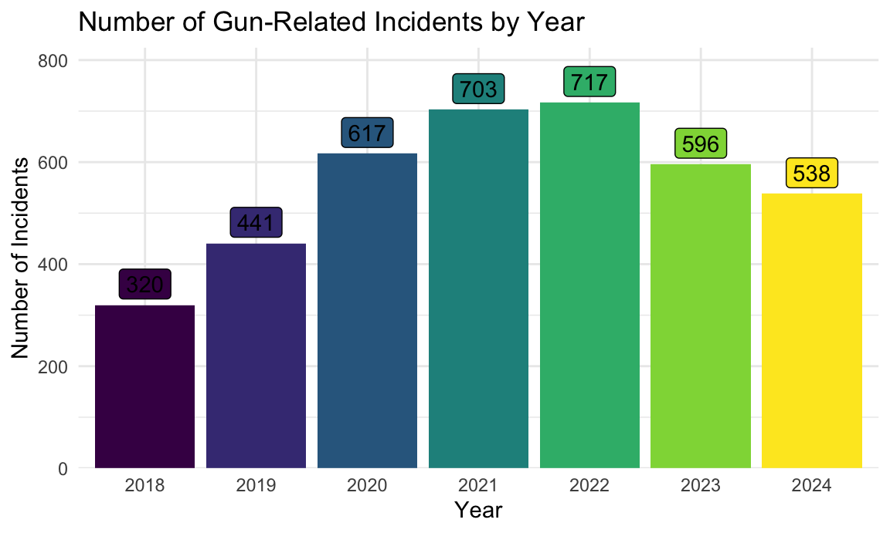
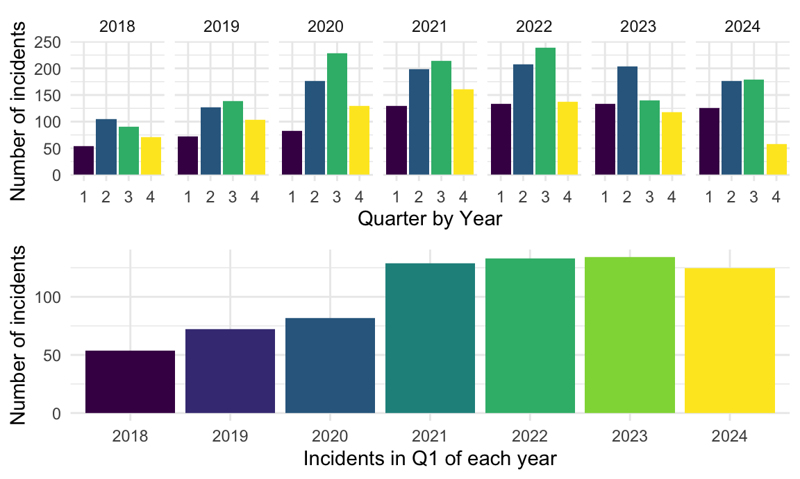
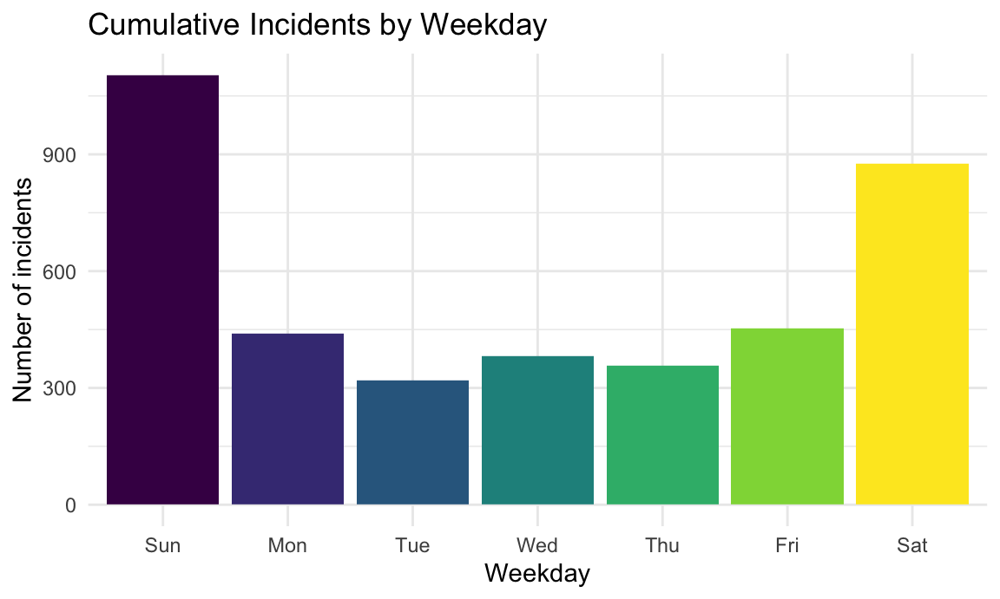
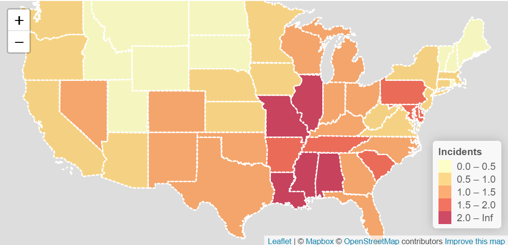
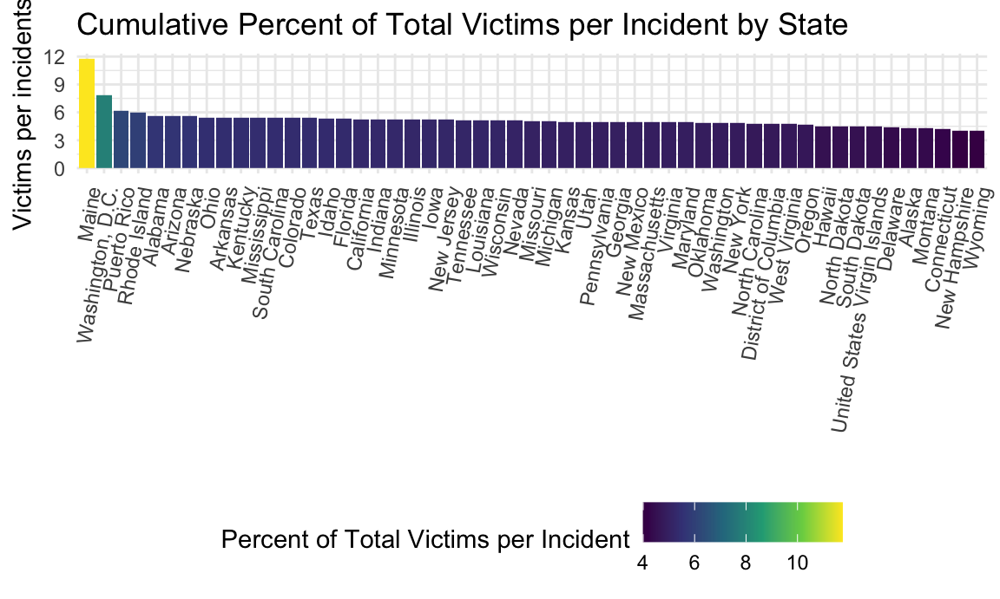
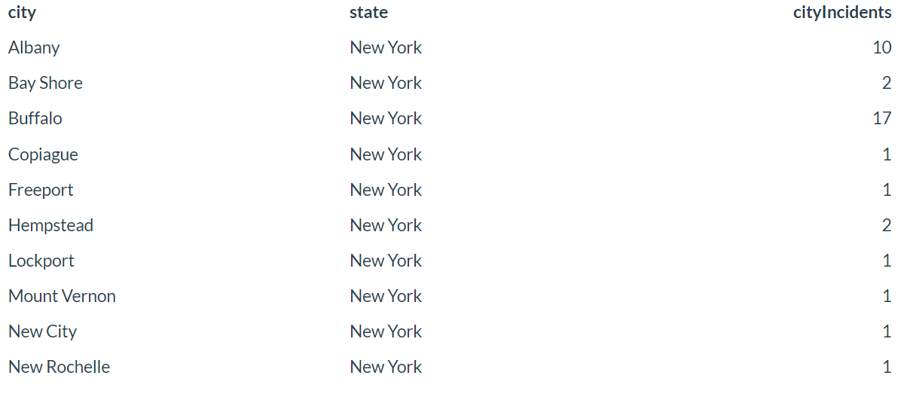

## Motivation

Gun violence remains a significant public health issue in the United States. Our project explores gun-related incidents (mass shootings) in the U.S. from 2018 to 2024. These events, unfortunately, have become increasingly common, with significant implications for public safety, policy, and mental health. This project aims to identify trends, patterns, and geographic hotspots associated with these tragic events. These insights can inform policymakers, law enforcement, and public health initiatives targeting gun violence reduction. The analysis includes temporal trends, geographic distribution, and incident severity. 

## Related Work

Existing research on mass shootings has often focused on patterns of violence, gun control, and the social factors that influence the occurrence of these tragic events. Our project seeks to build on this body of research by employing statistical methods to reveal more refined insights into the data. The project draws inspiration from the Gun Violence Archive (GVA) website (which aggregates mass shooting data), and from recent academic literature focusing on geographic and temporal trends in gun violence. Classroom analyses of spatial data also guided this work.

## Initial Questions

We started with basic questions such as:

* What are the spatial and temporal trends in mass shootings from 2018-2024?
* Are there patterns in the number of casualties (`dead`, `injured`, `total`) based on location or time of year?
* How does the distribution of mass shootings vary across cities and states?

As the analysis progressed, additional questions emerged:

* Are there clusters of high-casualty events in specific regions?
* Can any seasonal patterns or significant changes across years be identified?

## Data

**Sources**:

* Incident Dat*: Mass shooting data was sourced from [Gun Violence Archive](https://www.gunviolencearchive.org/) and covers mass shootings from 2018 to 2024. 
* City-Level Geographic Data: The SimpleMaps US cities dataset provided latitude (`lat`) and longitude (`lng`) for cities represented in the mass shooting data.
* State-Level Demographics: State-level demographic and socioeconomic data were obtained from the U.S. Census website for analysis. 

**Processing Steps**: 

* Annual datasets obtained through webscraping (`mass_shootings_2018` to `mass_shootings_2024`) were merged to create a consolidated dataset, `mass_shootings_2018_2024_cleaned.csv`. The variables included in this dataset are `date`, `city`, `state`, `dead`, `injured`, `total`, `description` for each shooting event recorded from 2018 to 2024. 

* Using data from the SimpleMaps US cities dataset, latitude (`lat`) and longitude (`lng`) variables were appended to each city represented in the dataset to create a new dataset `gun_df.csv`. This was to allow for spatial/geographical visualizations/analyses. 

* For state-level analysis, data for each state was extracted from the U.S. Census website. This process created the final dataset, `state_data.csv`. Each row in the state_data.csv dataset represents a specific state and its demographic, economic, and social statistics for a 5-year period ending in 2022. It provides information about the state's total population, median income, unemployment rate, percentage of residents with a bachelor's degree or higher, poverty rate, uninsured rate, and vacancy rate. 

## Exploratory Analysis

### EDA Summary

Through an analysis of general trends and basic GIS mapping of the available data, our findings aligned with established patterns in public health. We observed that both the number of crimes and the number of individuals affected by these crimes have decreased over time, reflecting broader societal improvements in reducing violence and its impacts. This decline underscores the value of continued public health efforts to address the root causes of violence and promote safer communities. The dataset contains information on gun-related incidents from 2018 to 2024 across different cities and states in the United States. 

#### **Geographic Analysis Using “Hot Zones”**:

Beyond a traditional heat map representation, the analysis utilized an advanced “hot zone” mapping technique, which provided a nuanced understanding of crime distributions at a city-wide level. Unlike simple density-based visualizations,these hot zones highlighted regions with concentrated crime activity, offering a more granular perspective on geographic crime patterns. This approach illuminated the spatial heterogeneity of criminal activity, revealing stark contrasts between neighborhoods and cities. The visualizations were particularly insightful in demonstrating how crime clusters correspond to underlying socioeconomic realities, enabling an explanation of how such disparities are spatially distributed.

#### **Exploratory Data Analysis and Public Health Correlations**:

The exploratory data analysis (EDA) underscored and solidified known public health trends through detailed tabular and graphical summaries. These tools provided a robust foundation for validating hypotheses regarding the intersection of socioeconomic conditions and crime rates. Key findings reaffirmed the strong correlation between poverty rates and crime prevalence. States and localities with high poverty levels exhibited the greatest frequency of crimes and the highest number of victims per incident. In contrast, areas with low poverty rates experienced significantly lower crime rates and fewer victims per crime. Among the states analyzed, Louisiana and Mississippi emerged as consistent outliers with high crime rates, reflecting systemic socioeconomic challenges. Conversely, New Hampshire, Vermont, and Connecticut demonstrated exemplary performance with some of the lowest crime statistics in the dataset.

#### **Socioeconomic Contrasts: The Case of Washington, D.C.**:

Washington, D.C., stood out as a particularly notable case, embodying stark socioeconomic contrasts. Despite its status as one of the wealthiest regions in the United States, with an estimated GDP per capita reaching as high as $295,000 annually in certain districts, this wealth is highly localized to the Capitol and adjacent affluent neighborhoods. The surrounding areas, including suburbs and communities such as Tanor Park and Silver Spring, are among the nation’s most impoverished and crime-affected zones. This extreme socioeconomic inequality within a compact geographic region is a primary driver of D.C.’s dichotomous profile, characterized by both extraordinary wealth and pervasive criminality.

#### **Anomalous Patterns in Maine**:

One of the more unexpected findings pertained to Maine. When examining the number of
victims per incident without adjusting for state population (unscaled analysis), Maine presented a higher-than-expected rate compared to national averages. This anomaly can be attributed to the state’s unique mix of urbanized areas, such as Bangor, Augusta, and Bar Harbor, juxtaposed with its predominantly rural landscape. The data suggests that criminal activity in Maine follows a consistent pattern across both urban and rural areas, but this uniformity leads to elevated per- incident victim counts when state population is not accounted for. While this trend does not entirely deviate from national norms, it is notable in the context of Maine’s demographic and geographic composition.

### Comparing Number of Incidents by Year, Quarter, Month, and Weekday

#### By Year:

First, we will compare the number of incidents by year.

The graph shows a general upward trend in gun-related incidents from 2018 to 2022. The peak would be at 717 incidents. The year 2020 shows a significant increase, rising from 441 incidents in 2019 to 617 incidents, and the trend continues with 703 incidents in 2021. However, from 2023 to 2024, the number of incidents appear to decline, with 596 incidents in 2023 and 538 incidents in 2024. This suggests that while the number of incidents has increased over the past few years, the decline in recent years might reflect a shift in trends or external factors impacting the data. Further analysis would be needed to understand the variations in detail.

#### By Quarter:

We will now compare the number of incidents by quarter for each year.

Let's further break it down by years and quarters.

The dataset on incidents of gun violence from 2018-2024 show some seasonality. We notice incidents in Q1 and Q4 are generally lower than those in Q2 and Q3. The second graph highlights that Q1 incidents increased steadily from 2018 to 2021, with smaller increases observed between 2021 and 2022, as well as between 2022 and 2023, suggesting a leveling-off trend during this period. In 2024, there is a slight decrease compared to 2023, but it is important to consider that 2024 is not yet complete. This potential plateau in Q1 incidents could signal a stabilization, though the overall trend since 2018 indicates a significant increase that still warrants attention.

#### By Month:

We will now compare the number of incidents by months.

The graph shows the number of incidents by month. Again, we see a clear seasonal trend. Incidents steadily rise from January through July, peaking in July (likely due to heightened activity during the summer months). A sharp decline follows from August to December, with November and December showing the lowest numbers. This could be influenced by colder weather, holiday periods, or shorter months (i.e., February). The visible trends suggest a relationship between weather (seasonal variations), social behavior, and incident rates. You can hover over the bars for exact values to compare these trends in more detail.

#### By Date:

Let's see the dates with the most incidents.

The table highlights the dates with the highest total number of incidents, aggregated over 2018-2024. July 5th and July 4th stand out with 49 and 48 incidents respectively, indicating that Independence Day celebrations significantly contribute to increased incidents, likely due to festivities and the use of fireworks or firearms. January 1st, with 31 incidents, suggests that New Year's Day also brings heightened risk, potentially linked to post-midnight celebrations and gatherings. The remaining dates predominantly occur in late June and July, with totals ranging from 21 to 26 incidents, reflecting a seasonal peak in incidents during summer months. May 18th, while slightly earlier, still aligns closely with this summer trend, reinforcing the pattern of increased incidents during warmer months. These results show the influence of holidays and seasonal trends on incident rates.

#### By Weekday:

We will now compare the number of incidents by weekday.

Sunday stands out as the most dangerous day, with incidents far exceeding 900. Saturdays follow closely with around 900 incidents. Fridays show a moderate increase with about 450 incidents, marking the start of the weekend.Meanwhile, weekdays see significantly lower numbers, with Tuesday recording the fewest incidents at around 200, followed by Thursday at about 350, Wednesday at 375, and Monday at 440. This trend show the influence of weekends or leisure culture on the frequency of incidents, with weekdays being relatively safer perhaps due to structured routines and fewer late-night activities.

### Incidents by State

The interactive bar graph above shows absolute number of gun violence by states. Hovering over the bars shows a label with the absolute number of incidents for a state. Illinois has the highest number of gun violence cases followed by Texas and California.

### Incidents Relative to State Population

This table provides the numerical values for the number of incidents, 2017 population, and the scaled number of incidents per 100,000 people.

This is the Number of Incidents scaled to state population. The order changes quite drastically where the District of Columbia, Louisiana, and Mississippi now lead and Idaho, Wyoming, and New Hampshire now have the lowest though the bottom is much more concentrated.

#### Interactive Map of Incidents by State:

Here an interactive map which displays the same data. It is scaled via a discrete legend so the heat map is slightly different than viridis but it conveys the same data in a more engaging format.

### Victims by State

This table provides the number of victims by state and the number of victims per incident by state. This shows how many people were involved in the average incident by state.

The bar graph above shows the number of victims per incident by state. Maine has the highest victims by incidents followed by Washington, DC followed by Puerto Rico.

This shows the average number of victims per incident when we scale by state. There is another dramatic reordering with Louisiana, Mississippi, and Illinois now taking the top spot. There is no data for DC.

#### Interactive Map of Victims by State:

Once again this is an interactive map which helps visualize and reinforce the previous information.

### Incidents by City

Here are the top number of incidents by city.

Here are the top number of incidents per city within New York State.

Here are the number of incidents in New York City.

For a city of 8 million people this seems quite low. This suggests that crime has fallen dramatically, crime is under-reported, or that the data collection mechanism is selective.

The bar graph above shows the number of incidents by city. Chicago has the highest number of incidents followed by Philadelphia followed by New York City.

We are merging a new dataset obtained from Simple Maps US Cities to our `gun_df` dataset to add the variables latitude (`lat`) and longitude (`lng`) of all included US cities for visualizations.

### Top Incidents by Victim Count

The table above shows the 13 most severe gun-related incidents in the dataset, ranked by the total number of victims (dead and injured). The incidents range from mass shootings at public events to tragic attacks in schools and other locations. Each entry provides details on the location, date, fatalities, injuries, and a brief description of the event, offering insights into the magnitude and context of these tragedies.

#### Interactive Map of Top Incidents by Victim Count:

## Discussion

Our project focused on understanding trends in gun-related incidents by analyzing data across time and location. We began by identifying patterns year by year and then narrowed our focus to quarterly trends. Next, we examined geographic patterns, first by state and then by city, using GIS tools to map incident hotspots. Inspired by John Snow’s historical work on cholera mapping, we used this approach to uncover potential causes and effects of gun-related incidents across the United States. Finally, we analyzed details of individual incidents, including the number of victims, to differentiate between types of violence, such as suicides, intimate partner violence, and multi-victim crimes.

Gun-related crimes were often concentrated in economically disadvantaged urban and rural areas, particularly in regions that have experienced industrial decline. Urban areas showed higher rates of multi-victim crimes, including gang violence and robberies, whereas rural areas had more single-victim incidents, often linked to suicides or domestic violence. These differences highlight how socioeconomic conditions shape the nature of gun violence.

We also found that gun-related incidents tended to peak at the end of the year, possibly due to increased stress during the holiday season. Over time, however, crime rates have gradually declined, with a sharper drop in multi-victim incidents compared to single-victim cases. This suggests that while efforts to reduce violent crimes like homicides may be effective, suicides—particularly those linked to mental health struggles—remain a persistent challenge.

Overall, the findings emphasize the need for targeted mental health resources and community-based interventions tailored to both urban and rural settings. By combining trend analysis with GIS mapping and socioeconomic insights, our project highlights the complex factors driving gun violence and offers a foundation for informed policy and public health strategies.

### Limitations

This project has several limitations that should be considered when interpreting the findings. First, the dataset does not distinguish between homicides and suicides (categorizing both as gun-related crimes). This lack of differentiation is significant, as the underlying factors driving suicide often differ markedly from those leading to homicide. Suicides are typically influenced by a combination of life course events, individual traits, and economic conditions, whereas homicides are more often linked to interpersonal conflict or criminal activity.

Additionally, the dataset may suffer from reporting bias and incomplete records as mass shooting incidents are not uniformly defined or consistently reported across states, potentially skewing the analysis. The granularity of state-level data further limits the findings, as it masks intra-state variations (e.g., differences between urban and rural areas).

The lack of recent data is another limitation, as it prevents analysis of the effects of recent economic downturns caused by inflation and reduced economic activity. These dual challenges—wages losing value due to inflation and fewer income-generating opportunities—likely exacerbate economic pressures, potentially influencing gun-related violence.

In the modeling phase, multicollinearity among socio-economic predictors may have impacted the reliability of individual variable coefficients, despite mitigation efforts. The use of linear regression, while effective for understanding relationships, assumes linearity and does not account for potential non-linear patterns or interactions between variables. Moreover, the relatively small number of observations (limited by the number of states) weakens the statistical power and generalizability of the findings, even though techniques such as bootstrapping and cross-validation were applied to improve model robustness.

Finally, while the exploratory data analysis (EDA) and visualizations are informative, they may oversimplify socio-economic relationships by presenting trends without accounting for the underlying variance or contextual factors. Future research should address these limitations by incorporating more granular, longitudinal data and exploring non-linear modeling techniques to better capture fluctuations in mass shootings and their predictors.

### Conclusion

The exploratory data analysis of the dataset (which covers related incidents in the U.S. from 2018 to 2024) reveals a few noteworthy trends and patterns. Incidents have generally increased over the years, peaking in 2022, with seasonal variations showing higher occurrences during summer months and weekends, particularly Sundays. Specific holidays like Independence Day and New Year's Day also contribute to spikes in incidents. State-level analysis highlights Illinois, Texas, and California as having the highest absolute numbers, while population-adjusted rates show the District of Columbia, Louisiana, and Mississippi leading. Overall, we were able to observe the temporal, geographic, and demographic factors on gun violence, highlighting the importance of context in understanding trends for safety or preventative measures. 

The modeling section employed regression techniques to analyze total shootings across U.S. states, focusing on socioeconomic predictors. Initial data preprocessing included merging and scaling dataset for interpretability, following by correlation analysis revealing strong positive associations, especially between shootings and population size. Poisson regression identified predictors like `total_populationE` and `median_incomeE` but showed overdispersion, requiring a Negative Binomial model. This refined model addressed multicollinearity by excluding highly correlated variables like `poverty_rate` and `bachelors_and_higher` to improve interpretability and predictive accuracy. Validation through bootstrap sampling and Monte Carlo cross-validation confirmed the robustness of the model with consistent coefficients and reliable predictions. Model performance was further assessed via RMSE comparisons and visualized predictions which reinforced its application in understanding the relationship of state-level factors influencing shooting incidents. 

This [R Shiny dashboard](https://kevinguo273.shinyapps.io/shiny_dashboard/) provides an interactive way of exploring mass shootings data from 2018 to 2024. It includes a map visualizing incident locations, bar charts summarizing total incidents by state and top states by gun violence incidents, and a searchable data table containing detailed information on individual shooting events (with a year range filter and a state selection dropdown).

