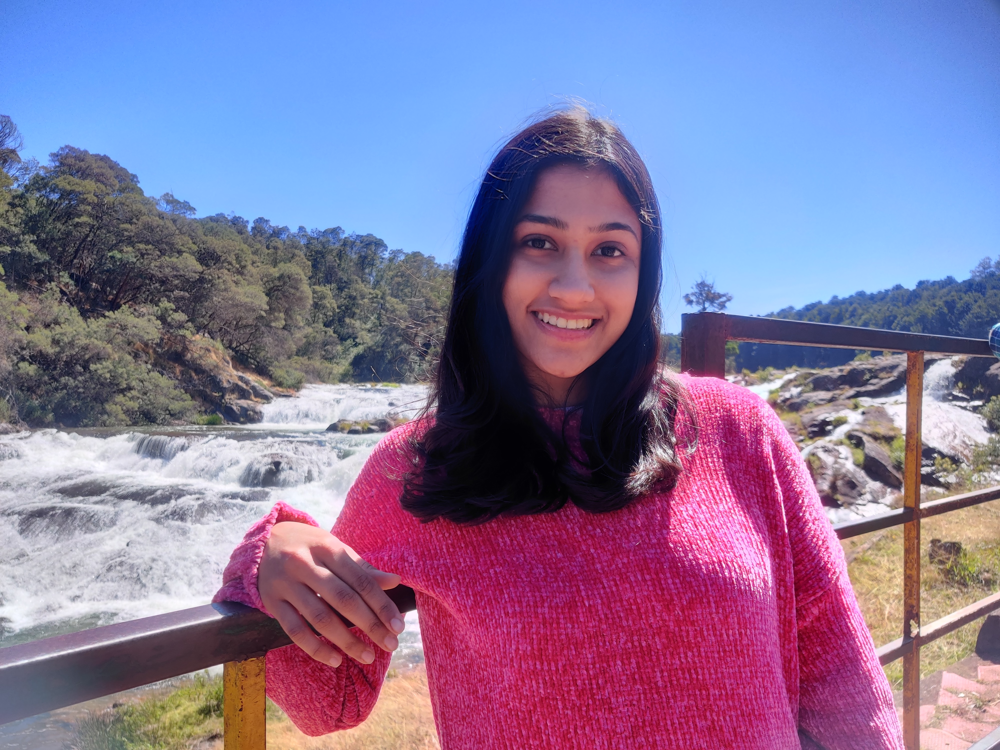

We are a team of MS and MPH students at Columbia University. Our diverse academic backgrounds and shared passion for public health have brought us together to work on this project, which focuses on the Analysis of Mass Shootings in the United States (2018–2024).

Through this project, we’ve aimed to deepen our understanding of applied biostatistics, data analysis, and data visualization while tackling one of the most pressing public health issues in the country. We hope that our findings and visualizations provide meaningful insights and inspire important conversations around this critical topic.

 

## **Team Members**:

<head>
    <meta charset="UTF-8">
    <meta name="viewport" content="width=device-width, initial-scale=1.0">
    <title>Team Members</title>
    
</head>
<body>

<!-- Xuanyu Guo -->
<table>
  <tr>
    <td class="text">
      <h3>Xuanyu Guo</h3>
      

      
I’m a first-year MS Biostatistics student at Columbia University, with a strong focus on applying ML and DL techniques to real-world problems in healthcare and beyond. My interests lie at the intersection of data science and software engineering, where I aim to leverage my statistical and computational skills to build scalable, impactful models. Whether through data analysis, predictive modeling, or software development, I am passionate about creating solutions that drive innovation.

    </td>
    <td class="image">
      
    </td>
  </tr>
</table>

<!-- Riya Nadkarni -->
<table>
  <tr>
    <td class="text">
      <h3>Riya Nadkarni</h3>
      

      
I am a second-year MPh student in the Epidemiology department with a certificate in Applied Biostatistics and Public Health Data Science at Columbia University Mailman School of Public Health. I have a Bachelor's in Pharmacy from the Institute of Chemical Technology, Mumbai, India. I’m passionate about using data analysis in public health, especially to understand and improve mental health outcomes through effective interventions.

    </td>
    <td class="image" style="padding-top: 40px;">
      
    </td>
  </tr>
</table>

<!-- Christiana Odewumi -->
<table>
  <tr>
    <td class="text">
      <h3>Christiana Odewumi</h3>
      

      
I am a second-year MPH student in the Epidemiology department, with a certificate in Applied Biostatistics and Public Health Data Science at Columbia University's Mailman School of Public Health. I have a Bachelor’s degree in Biology Pre-Med and a minor in Communications from the University of Massachusetts Boston. My academic and professional experiences have fostered my passion for leveraging data and evidence-based approaches to address pressing public health challenges.

    </td>
    <td class="image">
      
    </td>
  </tr>
</table>

<!-- Shehzrin Shah -->
<table>
  <tr>
    <td class="text">
      <h3>Shehzrin Shah</h3>
      

      
I am a second-year MPH student in Health Policy and Management at Columbia University's Mailman School of Public Health, pursuing a certificate in Applied Biostatistics and Public Health Data Science. With a B.S. in Psychology from the University of Texas at Austin, I am passionate about the intersection of health, medicine, and technology.

    </td>
    <td class="image">
      
    </td>
  </tr>
</table>

</body>
</html>

